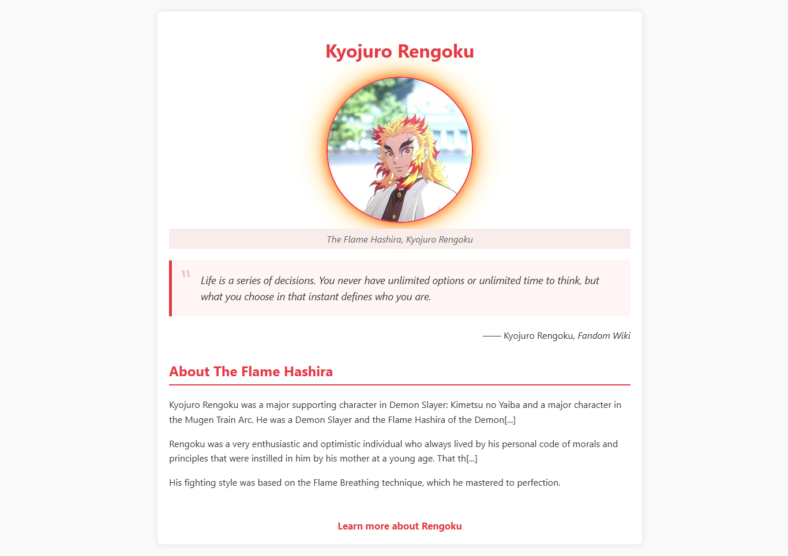

# 🌟 Tribute Page

A simple tribute page built as part of the [freeCodeCamp Responsive Web Design Certification](https://www.freecodecamp.org/learn/responsive-web-design/). This project focuses on HTML and CSS basics, semantic structure, and responsive layout.

 <!-- Optional: Add a screenshot of your project -->

---

## 🚀 Live Demo

Check out the live version here:  
👉 [https://inioluwa-a.github.io/Tribute-Page/](https://inioluwa-a.github.io/Tribute-Page/)

---

## 📚 What I Learned

- Basic HTML structure
- Styling with CSS
- Using semantic HTML elements
- Centering elements and responsive layout
- Creating links and using images effectively

---

## 🛠️ Built With

- HTML5
- CSS3
- Visual Studio Code
- Git & GitHub

---

## 📂 How to Use / Run Locally

1. Clone this repository:
   ```bash
   git clone https://github.com/inioluwa-a/Tribute-Page.git
